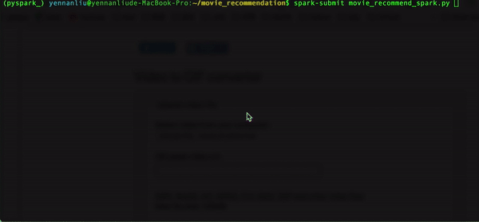

# movie_recommendation





## INTRO 
Build various recommend systems via user rating, movie data, and other meta data via CF, KNN, and DL models.The main idea of this prove-of-concept project is "making data production" via ML/DL apart from analysis level. The output can be dump csv/DB, APIs or web APPs. 

> There will be 4 different ways building the different recommend systems.
  Current plan is : Build CF model via Pyspark, Popularity model via Numpy, KNN model via scikit-learn, and the RNN model via Tensforflow/Keras. 

Please check the theory intro, step-by-step notebook, and quick start start below.


### THEORY 


- Collaborative Filtering (CF)

```python  

####  - User-Based Collaborative Filter

# 1)
# consider there is an user movie rating matrix :
# x-axis : user
# y-axis : movie 

	[[ 2  ?  0  0  4]
	 [ ?  ?  8  5  4]
	 [ 1 1  0  ?   3]
	 [ 3 2  2  ?   1]
	 [ 1 2  3  1   1] 
	 [ 1 2  3  ?   ?]]

# 2)
# the purpose of user-based CF is predicting the unknown rating of the movies haven't rated by the given user and give recommendation based on the user silimarity 
# for example if we have 3 user rating as below:
user1 	 [ 3 2  2  ?   1]
user2	 [ 1 2  3  1   1] 
user3	 [ 1 2  3  ?   ?]
# then based on user silimarity, we can say user2 and user3 are "much similar" then others. So we can push user2's movie taste to user3 


# 3)
# Here is the logic in python 

def cosine_similarity(v,w):
	import numpy as np 
    # v,w is a vector, return the cosine between the two vectors,
    # value between -1~1
    return np.dot(v,w)/(math.sqrt(np.dot(v,v) * np.dot(w,w)))


def users_similarity(users_movie_matrix):
    users_movie_matrix = []
    for i,user in enumerate(users_movie_matrix):
        similarity_vector = []
        for j in range(len(users_movie_matrix)):
        	# use cosine similarity
            similarity_val=cosine_similarity(user, users_movie_matrix[j])
            similarity_vector.append(similarity_val)
        users_movie_matrix.append(similarity_vector)
    return users_movie_matrix


```

```python 

    ####  - Item-Based Collaborative Filter
    # dev 
    
```


- Popularity 
	- Movie popularity based recommender 

- Similarity
	- User similarity based recommender (KNN)
- DL 
	- Collaborative Filtering  via Neural network  


### PROCESS  
- dev 


### FILE STRUCTURE 
```
yennanliu@yennanliude-MacBook-Pro:~/movie_recommendation$  tree --si

├── [5.2k]  README.md
├── [ 384]  archive
├── [ 160]  datasets 	     	             : main dataset (please download ml-latest via download_dataset.sh script )  
├── [ 580]  download_dataset.sh              : script download /dataset/ml-latest data 
├── [1.6k]  install_pyspark.sh               : script install pyspark 
├── [3.8k]  movie_recommend_KNN.py           : movie recommend via KNN (user similarity)
├── [ 152]  movie_recommend_NCF.py           : movie recommend via NN+CF (dev)
├── [9.9k]  movie_recommend_Similarity.py    : movie recommend via user similarity
├── [3.2k]  movie_recommend_benchmark.py     : movie recommend benchmark model 
├── [4.5k]  movie_recommend_popularity.py    : movie recommend via movie popularity
├── [ 37k]  movie_recommend_spark_CF.ipynb   : movie_recommend_spark_CF.py 's step by step nb demo 
├── [ 13k]  movie_recommend_spark_CF.py      : movie recommend via CF (pyspark ML)  


```


### QUICK START 


```bash 
# get the repo 
$ git clone https://github.com/yennanliu/movie_recommendation.git
# get needed dataset 
$ cd ~ && cd movie_recommendation/ && brew install Wget && bash download_dataset.sh

```

```bash
### CF model via spark ### 
# install pyspark and needed dataset 
$ cd ~ && bash /Users/$USER/movie_recommendation/install_pyspark.sh  && cd movie_recommendation/ && brew install Wget && bash download_dataset.sh
# declare env variables  
$ export SPARK_HOME=/Users/$USER/spark && export PATH=$SPARK_HOME/bin:$PATH
# run the pyspark model train script 
$ spark-submit  movie_recommend_spark.py 

# output 
For rank 4 the RMSE is 0.9432575570983046
For rank 8 the RMSE is 0.9566157499964845
For rank 12 the RMSE is 0.9521388924465031
The best model was trained with rank 4
************
For testing data the RMSE is 0.9491107183690944
************
[(2.0, 107), (97328.0, 1), (4.0, 13)]
random movid id :  [3613 4927 8845 1508 5692]
-------------------
Please rate following 5 random movies as new user teste interest : 
-------------------
movie_id : 3613
movie_name : Things Change (1988)
 * What is your rating? 3
-> Your rating for Things Change (1988) is : 3.0
movie_id : 4927
movie_name : "Last Wave
 * What is your rating? 1
-> Your rating for "Last Wave is : 1.0
insert movie_id : 8845
movie_id not exist
 * What is your rating? 0
-> Your rating for None is : 0.0
movie_id : 1508
movie_name : Traveller (1997)
 * What is your rating? 3
-> Your rating for Traveller (1997) is : 3.0
insert movie_id : 5692
movie_id not exist
 * What is your rating? 2
-> Your rating for None is : 2.0
New user ratings: [(9997, 3613, 3.0), (9997, 4927, 1.0), (9997, 8845, 0.0), (9997, 1508, 3.0), (9997, 5692, 2.0)]
[(1.0, 31.0, 2.5), (1.0, 1029.0, 3.0), (1.0, 1061.0, 3.0), (1.0, 1129.0, 2.0), (1.0, 1172.0, 4.0), (1.0, 1263.0, 2.0), (1.0, 1287.0, 2.0), (1.0, 1293.0, 2.0), (1.0, 1339.0, 3.5), (1.0, 1343.0, 2.0)]
<pyspark.mllib.recommendation.MatrixFactorizationModel object at 0x10f4b1240>
=======================
[Rating(user=9997, product=267, rating=1.9431035590658032), Rating(user=9997, product=18, rating=2.4471404575434224), Rating(user=9997, product=227, rating=1.8898669807166826), Rating(user=9997, product=639, rating=1.2313836204250688), Rating(user=9997, product=630, rating=2.0651897033288247), Rating(user=9997, product=248, rating=0.9056995408584969), Rating(user=9997, product=183, rating=1.096099378407863), Rating(user=9997, product=62, rating=2.3965661520727375), Rating(user=9997, product=318, rating=2.693287049630902), Rating(user=9997, product=6, rating=2.403548622949053)]
=======================
=======================
TOP recommended movies (with more than 25 reviews):
('Forrest Gump (1994)', 2.740902212733893, 341)
('Braveheart (1995)', 2.7270995452301943, 228)
('"Shawshank Redemption', 2.693287049630902, 311)
("Schindler's List (1993)", 2.6615360145071953, 244)
('Much Ado About Nothing (1993)', 2.646212665422727, 60)
('Welcome to the Dollhouse (1995)', 2.578621020576323, 30)
('Philadelphia (1993)', 2.5727445302939564, 86)
.....
```


```bash 
### user similarity model ###
$ python movie_recommend_Similarity.py 

# output 

------------------------------------------------------------------------------------
Training data movies for the user userid: 37:
------------------------------------------------------------------------------------
3481
3564
364
4018
1246
3948
2085
912
4034
4054
2028
3538
1307
3977
3751
1196
940
1193
2858
1907
595
920
2081
1
902
2273
4011
4015
----------------------------------------------------------------------
Recommendation process going on:
----------------------------------------------------------------------
------------
[3481, 3564, 364, 4018, 1246, 3948, 2085, 912, 4034, 4054, 2028, 3538, 1307, 3977, 3751, 1196, 940, 1193, 2858, 1907, 595, 920, 2081, 1, 902, 2273, 4011, 4015]
------------
no. of unique movies in the training set: 8401
Non zero values in cooccurence_matrix :142279
   userId  movieId    rating  view_count
0    37.0   1380.0  0.167462         1.0
1    37.0   2918.0  0.165759         2.0
2    37.0   1270.0  0.165678         3.0
3    37.0    919.0  0.163948         4.0
4    37.0   2762.0  0.163071         5.0
5    37.0   1682.0  0.162160         6.0
6    37.0   4027.0  0.160869         7.0
7    37.0   2797.0  0.159535         8.0
8    37.0   1704.0  0.158849         9.0
9    37.0   4306.0  0.158516        10.0


```


```bash 
### Benchmark model ###
$  python movie_recommend_benchmark.py

# output 

recommend list  : 
    movieId  total_view  avg_rating
0       356       341.0    4.054252
1       296       324.0    4.256173
2       318       311.0    4.487138
3       593       304.0    4.138158
4       260       291.0    4.221649
5       480       274.0    3.706204
6      2571       259.0    4.183398
7         1       247.0    3.872470
8       527       244.0    4.303279
9       589       237.0    4.006329
10     1196       234.0    4.232906
11      110       228.0    3.945175
12     1270       226.0    4.015487
13      608       224.0    4.256696
14     2858       220.0    4.236364
15     1198       220.0    4.193182
16      780       218.0    3.483945
17     1210       217.0    4.059908
18      588       215.0    3.674419
19      457       213.0    3.953052

```

### REFERENCE
- dev 


